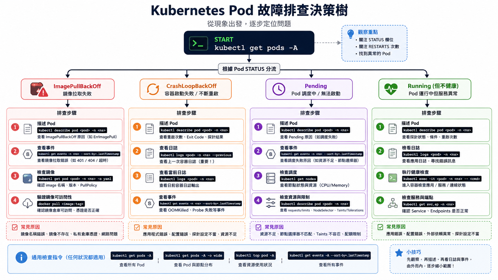

# Kubernetes 純新手訓練：NPC 直播平台救援任務

> 草稿用途：這份文件先示範完整改寫語氣與教學節奏。正式放回 Killercoda 時，會再拆回 `intro.md`、`stage0-architecture.md`、`step1-cluster.md` 等檔案。

## Intro：你被叫進戰情室了

### 這一關的情境

你是剛加入 NPC 直播平台的新手 SRE 實習生。

上班第一天，坤哥開直播帶貨，流量突然暴增。聊天室還在刷，訂單還在進，但後端服務開始忽快忽慢。前輩沒有叫你重開機，也沒有叫你先猜誰改壞。

前輩只丟給你一句話：

> 先看現場。Kubernetes 通常已經把線索留在狀態、事件和 logs 裡。

今天你不用背完 Kubernetes。你只要跟著任務走，學會三件事：

- 現場有哪些機器在工作？
- 哪個服務看起來不正常？
- Kubernetes 為什麼能把壞掉的服務補回來？

### 你先知道這個就好

SRE 可以先想成「系統救援隊」。SRE 的工作不是遇到問題就亂按重啟，而是先觀察、找線索、確認影響範圍，再做安全的修復。

Kubernetes 可以先想成「服務調度中心」。它不是一台單純的主機，而是一整套系統，負責管理很多台機器和很多個服務。

`kubectl` 是你今天的對講機。你會用它問 Kubernetes：

- 現場有哪些機器？
- 哪些服務正在跑？
- 哪裡出錯了？
- 目前狀態是不是符合我們想要的狀態？

### 任務地圖

```text
事故通知
  |
  v
Stage 0  先拿地圖：Kubernetes 裡誰管事、誰工作？
  |
  v
Stage 1  點名機器：這個 cluster 裡有哪些 Node？
  |
  v
Stage 2  維護機器：讓一台 Node 暫時不要接新工作
  |
  v
Stage 3  查壞服務：從 Pod 狀態、事件、logs 找線索
  |
  v
Stage 4  自動補位：用 Deployment 維持服務副本數
```

### 小任務：確認你真的懂

如果直播平台變慢，你第一步應該是：

A. 先把全部機器重開  
B. 先看 Kubernetes 現場狀態  
C. 先猜是不是網路壞掉

建議答案是 B。救援第一步不是猜，是看證據。

---

## Stage 0：Kubernetes 架構導覽

### 這一關的情境

你剛進戰情室，螢幕上有一堆陌生名詞：Pod、Node、Control Plane、Scheduler、kubelet。

前輩說：

> 不用先背。先把 Kubernetes 當成一間大型直播後台。有人負責接收指令，有人負責排班，有人負責記錄現場狀態，也有人真的在機器上跑服務。

這一關的目標是拿到地圖。你不用理解所有細節，只要知道每個角色大概在做什麼。

### 你先知道這個就好

Cluster 是整個 Kubernetes 現場。你可以把它想成一整個直播後台機房，不是一台電腦，而是一群被 Kubernetes 管理的機器。

Control Plane 是指揮中心。它負責接收操作、記住狀態、安排 Pod 去哪台 Node、持續修正現場。

Node 是工作機器。真正執行服務的地方通常在 Node 上。

Pod 是 Kubernetes 裡最小的服務單位。你可以先把 Pod 想成「一個被包好的服務小盒子」，裡面通常跑著 container。

`kubectl` 是你和 Kubernetes 說話的工具。你在終端機打指令，指令會送到 API Server，再由 Kubernetes 內部元件處理。

### 看圖理解

先看這張架構圖：


看圖時照這個順序：

1. 先看左邊：使用者透過 `kubectl` 送出指令。
2. 再看中間：API Server 是入口，etcd 記住狀態，Scheduler 負責安排，Controller Manager 負責修正。
3. 最後看右邊：Worker Node 上有 kubelet、container runtime 和 Pod，這裡才是真的跑服務的地方。

你現在不需要背每個箭頭。先記住一句話：

> Kubernetes 的核心工作，是持續把「現在的狀態」拉回「你想要的狀態」。

### 跟著做

這一關先不急著操作。我們先把等一下會用到的角色記起來：

| 名詞 | 白話說法 | 你要記住的重點 |
| --- | --- | --- |
| `kubectl` | 對講機 | 你用它問 Kubernetes 現場狀態 |
| API Server | 櫃台入口 | 所有操作先進到這裡 |
| `etcd` | 記事本 | 記住 cluster 狀態 |
| Scheduler | 排班員 | 決定 Pod 要去哪台 Node |
| Controller | 巡場前輩 | 發現狀態不對就修正 |
| Node | 工作機器 | 真正承載服務 |
| kubelet | Node 上的現場人員 | 照顧該 Node 上的 Pod |
| Pod | 服務小盒子 | Kubernetes 最小部署單位 |

### 看懂結果

等一下你查 Node、Pod、Deployment，其實都在回答同一件事：

```text
我想要的狀態     Kubernetes 目前看到的狀態
     |                       |
     +----------比對---------+
                 |
                 v
          不一致就修正
```

例如你說「我要 3 個 Pod」，但現場只剩 2 個，Kubernetes 就會想辦法補回第 3 個。

### 常見誤會

- Kubernetes 不是一台機器，而是一組管理系統。
- Pod 不是 Node。Node 是機器，Pod 是跑在機器上的服務單位。
- `kubectl` 本身不是 Kubernetes，它只是你操作 Kubernetes 的工具。

### 小任務：確認你真的懂

如果一個 Pod 壞掉後，Kubernetes 又自動補了一個新的 Pod，這比較像哪個角色在工作？

A. 只負責存資料的 `etcd`  
B. 持續檢查並修正狀態的 Controller  
C. 你手上的 `kubectl`

建議答案是 B。Controller 的重點就是持續比對狀態，發現不一致就修正。

---

## Stage 1：認識你的 Cluster

### 這一關的情境

你拿到地圖後，前輩說：

> 好，現在點名。先不要修服務，先看這個 Kubernetes 現場裡到底有幾台機器。

這一關你要學會看 Node。Node 就像直播後台裡的一台台工作機器，有些負責管理，有些負責跑服務。

### 你先知道這個就好

Cluster 是整個 Kubernetes 現場。

Node 是 cluster 裡的一台機器。你可以先把 Node 想成一張工作桌，有些桌子負責指揮，有些桌子負責實際處理服務。

Control plane node 比較像指揮中心，負責管理 cluster。

Worker node 比較像工作站，負責跑實際服務。

`STATUS` 是第一個健康訊號。看到 `Ready` 代表 Kubernetes 目前認為這台 Node 可以工作，但這只是入口，不是完整診斷。

### 看圖理解

```text
Cluster：整個直播後台
  |
  +-- controlplane：比較像指揮中心
  |
  +-- node01：比較像工作機器
```

你現在要做的事不是修壞掉的服務，而是先問：

> 這個後台裡有幾台機器？誰像指揮中心？誰像工作機器？

### 跟著做

這個指令要查 cluster 裡有哪些 Node：

```bash
kubectl get nodes
```

你可能會看到類似結果：

```text
NAME           STATUS   ROLES           AGE   VERSION
controlplane   Ready    control-plane   20m   v1.30.0
node01         Ready    <none>          19m   v1.30.0
```

這個指令會顯示更多資訊，例如內部 IP：

```bash
kubectl get nodes -o wide
```

你可能會看到類似結果：

```text
NAME           STATUS   ROLES           VERSION   INTERNAL-IP
controlplane   Ready    control-plane   v1.30.0   192.168.0.10
node01         Ready    <none>          v1.30.0   192.168.0.11
```

### 看懂結果

先看這幾欄：

| 欄位 | 怎麼看 |
| --- | --- |
| `NAME` | Node 的名字 |
| `STATUS` | `Ready` 代表目前可用 |
| `ROLES` | `control-plane` 代表它像指揮中心 |
| `VERSION` | 這台 Node 的 Kubernetes 版本 |
| `INTERNAL-IP` | Cluster 內部使用的 IP |

如果 `ROLES` 是 `<none>`，新手可以先理解成：它不是 control plane，通常更像 worker node。

### 常見誤會

- `<none>` 不是壞掉，只是沒有顯示特殊角色。
- `Ready` 不代表應用程式一定正常，只代表 Node 本身目前看起來可工作。
- 一開始不要急著看所有細節，先會分辨「指揮中心」和「工作機器」就很好。

### 小任務：確認你真的懂

看到下面輸出時，哪一台比較像指揮中心？

```text
NAME           STATUS   ROLES
controlplane   Ready    control-plane
node01         Ready    <none>
```

答案是 `controlplane`。線索是 `ROLES` 欄位裡的 `control-plane`。

---

## Stage 2：Node 基本維運

### 這一關的情境

直播平台還在跑，但一台 worker node 要準備維護。你不能直接把它拔掉，因為上面可能還有服務在跑。

前輩說：

> 專業一點。先告訴 Kubernetes：這台機器先不要接新的 Pod。已經在上面跑的東西先不要亂動。

這一關你要學會 `cordon` 和 `uncordon`。

### 你先知道這個就好

Scheduler 是排班員。新的 Pod 要去哪台 Node，通常由 Scheduler 決定。

`cordon` 的意思是把 Node 圍起來，暫時不要讓新的 Pod 排到這台 Node。

`uncordon` 的意思是解除圍線，讓這台 Node 可以重新接受新的 Pod。

`SchedulingDisabled` 不代表 Node 壞掉。它代表這台 Node 目前不接新的 Pod。

已經在 Node 上跑的 Pod，不會因為 `cordon` 自動搬走。

### 看圖理解

```text
cordon 前

Scheduler
  |
  +--> node01 可以接新的 Pod

cordon 後

Scheduler
  |
  +--> node01 還是 Ready
       但暫時不接新的 Pod
```

你可以把 `cordon` 想成餐廳門口掛上「暫停收新客」。餐廳不一定壞掉，裡面的客人也不會立刻被趕走，只是先不要再安排新客人進去。

### 跟著做

先看目前 Node 狀態：

```bash
kubectl get nodes
```

選一台 worker node，讓它暫停接受新的 Pod：

```bash
kubectl cordon <node-name>
```

再查一次 Node 狀態：

```bash
kubectl get nodes
```

你可能會看到類似結果：

```text
NAME           STATUS                     ROLES
controlplane   Ready                      control-plane
node01         Ready,SchedulingDisabled   <none>
```

維護結束後，讓它重新接受新的 Pod：

```bash
kubectl uncordon <node-name>
kubectl get nodes
```

### 看懂結果

重點看 `STATUS` 欄位：

| 狀態 | 白話意思 |
| --- | --- |
| `Ready` | Node 目前可以工作 |
| `Ready,SchedulingDisabled` | Node 還活著，但 Scheduler 不會再排新的 Pod 過去 |

這一關最重要的觀念是：

> `cordon` 改的是「能不能接新工作」，不是宣告這台機器壞掉。

### 常見誤會

- `SchedulingDisabled` 不是故障訊號。
- `cordon` 不會自動移走已經在上面跑的 Pod。
- 如果你不確定哪台是 worker node，回 Stage 1 看 `ROLES`。

### 小任務：確認你真的懂

`Ready,SchedulingDisabled` 比較接近哪個意思？

A. Node 壞掉了  
B. Node 還 Ready，但暫時不接新的 Pod  
C. Pod 全部被刪掉了

建議答案是 B。

---

## Stage 3：Pod 異常排查

### 這一關的情境

客服頻道開始熱鬧了。

有人說直播間卡，有人說結帳慢，也有人說「是不是 Kubernetes 壞了」。前輩看了你一眼：

> 不要先猜。先從 Pod 狀態開始查。狀態是入口，事件和 logs 才是線索。

這一關你要學會 Pod 排查的基本路線。

### 你先知道這個就好

Pod 是 Kubernetes 裡最小的服務單位。對新手來說，你可以先把 Pod 想成一個服務小盒子。

`STATUS` 像急診分診牌。它會先告訴你目前看起來怎樣，但不會直接告訴你完整病因。

`describe pod` 像看病歷和現場事件，能看到排程、拉 image、重啟、錯誤事件。

`logs` 像打開服務自己的日記，最接近應用程式裡發生的錯誤。

`events` 像整個 cluster 的最近事故紀錄，可以看 Kubernetes 最近發生過什麼事。

### 看圖理解

先記住這條查案路線：

```text
先看有哪些 Pod
    |
    v
找到異常 STATUS
    |
    v
describe 看 Kubernetes 事件
    |
    v
logs 看應用程式輸出
    |
    v
events 看 cluster 最近線索
```

章末再用這張完整決策樹做總整理：



### 跟著做

這個指令會看所有 namespace 裡的 Pod：

```bash
kubectl get pods -A
```

你可能會看到類似結果：

```text
NAMESPACE   NAME                         READY   STATUS             RESTARTS
default     web-7c9d4f8c9f-abcde         1/1     Running            0
default     api-64d7bbf8cc-x1y2z         0/1     CrashLoopBackOff   5
default     worker-558dd99f8-pqrst       0/1     ImagePullBackOff   0
```

找到異常 Pod 後，先看 Kubernetes 對它的描述和事件：

```bash
kubectl describe pod <pod-name> -n <namespace>
```

如果 Pod 有啟動過，但程式一直崩潰，查看 logs：

```bash
kubectl logs <pod-name> -n <namespace>
```

如果 Pod 一直重啟，上一個 container 的 logs 有時更有用：

```bash
kubectl logs <pod-name> -n <namespace> --previous
```

查看最近 cluster 事件：

```bash
kubectl get events -A --sort-by=.lastTimestamp
```

### 看懂結果

先用狀態小卡判斷下一步：

| 看到什麼 | 白話意思 | 先查哪裡 |
| --- | --- | --- |
| `ImagePullBackOff` | Kubernetes 拉不到 image，服務盒子還沒成功打開 | `describe pod` 的 Events、image 名稱、tag、registry 權限 |
| `CrashLoopBackOff` | container 有啟動，但程式一直崩潰重開 | `logs` 和 `logs --previous` |
| `Pending` | Pod 還沒被安排到 Node | `describe pod` 裡的 scheduling events |
| `Running` 但服務不正常 | Pod 看起來在跑，但應用程式可能不健康 | `logs`，必要時再看健康檢查設定 |

`describe pod` 最下面通常有 `Events`。新手可以先養成習慣：看到異常狀態，就去 `Events` 找 Kubernetes 留下的原因。

### 常見誤會

- `Running` 不等於服務一定健康。
- `CrashLoopBackOff` 不是 image 拉不到，而是程式啟動後又崩潰。
- `ImagePullBackOff` 很常是 image 名稱、tag、權限或網路問題。
- 不要只看 `STATUS` 就下結論。`STATUS` 是入口，不是答案。

### 小任務：確認你真的懂

如果你看到：

```text
STATUS             RESTARTS
CrashLoopBackOff   8
```

你會先看哪裡找最接近應用程式錯誤的線索？

A. `kubectl logs <pod-name> -n <namespace>`  
B. `kubectl cordon <node-name>`  
C. `kubectl get nodes`

建議答案是 A。`CrashLoopBackOff` 代表程式啟動後反覆崩潰，logs 通常最接近程式錯誤原因。

---

## Stage 4：Deployment 修復與擴充

### 這一關的情境

你查完 Pod 後，前輩出了一題現場小測驗：

> 如果我手動刪掉一個 Pod，服務是不是就少一份了？

你還沒回答，前輩就刪了一個測試 Pod。幾秒後，新 Pod 又長回來。

前輩說：

> 這就是 Kubernetes 最重要的直覺：我們不是只建立一次 Pod，而是宣告希望系統保持什麼狀態。

這一關你要學 Deployment。

### 你先知道這個就好

Deployment 可以先想成「班表」。你不只是在說「現在開一個人上班」，而是在說「這個崗位永遠要有 3 個人值班」。

`replicas` 是你想要的副本數。例如 `replicas=3`，就是希望同一個服務有 3 份 Pod 在跑。

desired state 是你想要的狀態。

current state 是 Kubernetes 目前看到的狀態。

Controller 會一直比對兩者。如果你想要 3 個 Pod，但目前只剩 2 個，它就會補 1 個。

### 看圖理解

先用值班人力想像：

```text
班表規定：櫃台要 3 個人
現場狀態：現在只剩 2 個人
系統動作：補 1 個人回來
```

Deployment 也是同樣概念：

```text
Deployment 宣告：replicas = 3
Kubernetes 看到：目前只有 2 個 Pod
Controller 動作：建立新的 Pod 補回 3 個
```

看這張圖時，先看左邊 desired state，再看右邊 current state，最後看中間 controller loop：


### 跟著做

建立一個測試 Deployment，宣告要 3 份 nginx：

```bash
kubectl create deployment web --image=nginx --replicas=3
```

查看 Deployment：

```bash
kubectl get deployments
```

你可能會看到類似結果：

```text
NAME   READY   UP-TO-DATE   AVAILABLE
web    3/3     3            3
```

查看它背後建立出的 ReplicaSet：

```bash
kubectl get replicasets
```

查看 Pod 實際跑在哪些 Node：

```bash
kubectl get pods -o wide
```

手動刪掉其中一個 Pod：

```bash
kubectl delete pod <pod-name>
```

等幾秒，再查一次：

```bash
kubectl get pods -o wide
kubectl get deployments
```

把副本數從 3 調成 5：

```bash
kubectl scale deployment web --replicas=5
kubectl get pods -o wide
```

### 看懂結果

你手動刪掉一個 Pod 後，會看到兩件事：

- 舊 Pod 消失。
- 新 Pod 被建立，讓數量回到 Deployment 宣告的 `replicas`。

這不是魔法，也不是 Pod 自己復活。真正記住「我要幾份」的是 Deployment，負責補回來的是 controller loop。

| 你做了什麼 | Kubernetes 怎麼理解 |
| --- | --- |
| 建立 Deployment 並設定 `replicas=3` | 你宣告希望有 3 份 Pod |
| 刪掉一個 Pod | current state 變成只剩 2 份 |
| 等幾秒再查 | Controller 發現少了，補一份 |
| scale 到 5 | desired state 改成 5 份 |

### 常見誤會

- Deployment 不是只幫你建立 Pod 一次，它會持續維持副本數。
- 刪掉 Pod 後補回來，不代表剛剛那個 Pod 復活，而是建立了一個新的 Pod。
- Kubernetes 是控制迴圈，不是你按下指令後每件事都立刻同步完成。等幾秒再查很正常。

### 小任務：確認你真的懂

你建立了：

```bash
kubectl create deployment web --image=nginx --replicas=3
```

接著手動刪掉 1 個 Pod。幾秒後 Kubernetes 又補回 1 個新的 Pod。

真正記住「我要 3 份」的是誰？

A. 被刪掉的 Pod  
B. Deployment  
C. `kubectl get pods`

建議答案是 B。

---

## Finish：救援任務回報

### 這一關的情境

事故現場先收工。你還不是 Kubernetes 大師，但你已經完成新手 SRE 第一輪任務。

你沒有靠猜，也沒有靠亂重開。你做的是：

1. 先看 Kubernetes 地圖。
2. 再點名 Node。
3. 再理解維護 Node 時怎麼暫停接新 Pod。
4. 接著用狀態、事件、logs 排查 Pod。
5. 最後看懂 Deployment 為什麼會把 Pod 補回來。

### 你現在能做到的事

你現在可以用 `kubectl get nodes` 看 cluster 裡有哪些 Node。

你可以從 `ROLES` 分辨哪台比較像 control plane，哪台比較像 worker node。

你知道 `cordon` 是讓 Node 暫停接受新的 Pod，`uncordon` 是恢復接受新的 Pod。

你知道看到 Pod 異常時，不能只盯著 `STATUS`。你會接著看 `describe`、`events` 和 `logs`。

你知道 Deployment 的重點是維持副本數，也就是把 current state 拉回 desired state。

### 最後總整理

```text
查現場
  kubectl get nodes
  kubectl get pods -A

找線索
  kubectl describe pod ...
  kubectl logs ...
  kubectl get events ...

維持狀態
  Deployment + replicas
  desired state vs current state
```

### 小任務：確認你真的懂

請用自己的話回答這三題：

1. Node 和 Pod 差在哪裡？
2. 看到 `CrashLoopBackOff` 時，為什麼要看 logs？
3. 為什麼刪掉 Deployment 管理的 Pod 後，Kubernetes 會補新的 Pod？

如果你能回答這三題，你已經抓到這堂課最重要的骨架了。

### 收尾句

Kubernetes 入門不是先背百科全書。

它的第一步是學會看現場：

> 哪裡在跑？哪裡異常？Kubernetes 想維持什麼狀態？現在狀態和目標差在哪裡？

只要你開始用這個方式看問題，就已經從「看到錯誤就慌」往「看線索做判斷」前進一大步。
