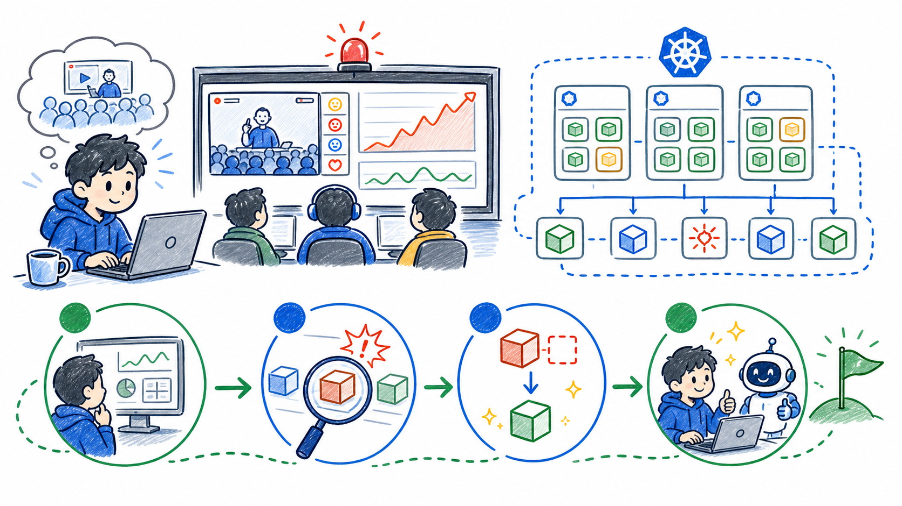

# Kubernetes 純新手訓練：NPC 直播平台救援任務

## 你被叫進戰情室了

你是剛加入 NPC 直播平台的新手 SRE 實習生。

上班第一天，坤哥開直播帶貨，流量突然暴增。聊天室還在刷，訂單還在進，但後端服務開始忽快忽慢。前輩沒有叫你重開機，也沒有叫你先猜誰改壞。

前輩只丟給你一句話：

> 先看現場。Kubernetes 通常已經把線索留在狀態、事件和 logs 裡。



## 今天你要學會什麼

今天不用背完整本 Kubernetes 百科全書。你只要跟著任務走，學會三件事：

- 現場有哪些機器在工作？
- 哪個服務看起來不正常？
- Kubernetes 為什麼能把壞掉的服務補回來？

## 你先知道這個就好

SRE 可以先想成「系統救援隊」。SRE 的工作不是遇到問題就亂按重啟，而是先觀察、找線索、確認影響範圍，再做安全的修復。

Kubernetes 可以先想成「服務調度中心」。它不是一台單純的主機，而是一整套系統，負責管理很多台機器和很多個服務。

`kubectl` 是你今天的對講機。你會用它問 Kubernetes：

- 現場有哪些機器？
- 哪些服務正在跑？
- 哪裡出錯了？
- 目前狀態是不是符合我們想要的狀態？

## 任務地圖

```text
事故通知
  |
  v
Stage 0  先拿地圖：Kubernetes 裡誰管事、誰工作？
  |
  v
Stage 1  點名機器：這個 cluster 裡有哪些 Node？
  |
  v
Stage 2  維護機器：讓一台 Node 暫時不要接新工作
  |
  v
Stage 3  查壞服務：從 Pod 狀態、事件、logs 找線索
  |
  v
Stage 4  自動補位：用 Deployment 維持服務副本數
```

## 遊戲規則

- 先觀察，再下結論
- 只相信 `kubectl` 查到的現場證據
- 不需要背完所有名詞，先掌握能救場的核心路徑
- 看到錯誤訊息不要慌，把它當成 Kubernetes 留下的線索

## 小任務：確認你真的懂

如果直播平台變慢，你第一步應該是：

A. 先把全部機器重開  
B. 先看 Kubernetes 現場狀態  
C. 先猜是不是網路壞掉

建議答案是 B。救援第一步不是猜，是看證據。
