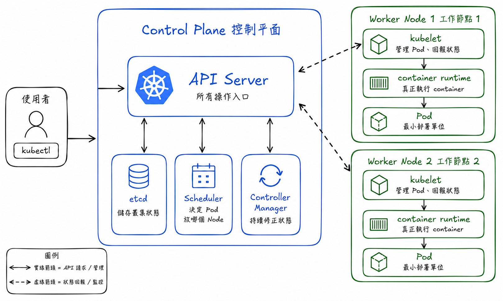

# Stage 0：Kubernetes 架構導覽

## 這一關的情境

你剛進戰情室，螢幕上有一堆陌生名詞：Pod、Node、Control Plane、Scheduler、kubelet。

前輩說：

> 不用先背。先把 Kubernetes 當成一間大型直播後台。有人負責接收指令，有人負責排班，有人負責記錄現場狀態，也有人真的在機器上跑服務。

這一關的目標是拿到地圖。你不用理解所有細節，只要知道每個角色大概在做什麼。

## 你先知道這個就好

Cluster 是整個 Kubernetes 現場。你可以把它想成一整個直播後台機房，不是一台電腦，而是一群被 Kubernetes 管理的機器。

Control Plane 是指揮中心。它負責接收操作、記住狀態、安排 Pod 去哪台 Node、持續修正現場。

Node 是工作機器。真正執行服務的地方通常在 Node 上。

Pod 是 Kubernetes 裡最小的服務單位。你可以先把 Pod 想成「一個被包好的服務小盒子」，裡面通常跑著 container。

`kubectl` 是你和 Kubernetes 說話的工具。你在終端機打指令，指令會送到 API Server，再由 Kubernetes 內部元件處理。

## 看圖理解

先看這張架構圖：



看圖時照這個順序：

1. 先看左邊：使用者透過 `kubectl` 送出指令。
2. 再看中間：API Server 是入口，etcd 記住狀態，Scheduler 負責安排，Controller Manager 負責修正。
3. 最後看右邊：Worker Node 上有 kubelet、container runtime 和 Pod，這裡才是真的跑服務的地方。

你現在不需要背每個箭頭。先記住一句話：

> Kubernetes 的核心工作，是持續把「現在的狀態」拉回「你想要的狀態」。

## 角色速查表

| 名詞 | 白話說法 | 你要記住的重點 |
| --- | --- | --- |
| `kubectl` | 對講機 | 你用它問 Kubernetes 現場狀態 |
| API Server | 櫃台入口 | 所有操作先進到這裡 |
| `etcd` | 記事本 | 記住 cluster 狀態 |
| Scheduler | 排班員 | 決定 Pod 要去哪台 Node |
| Controller | 巡場前輩 | 發現狀態不對就修正 |
| Node | 工作機器 | 真正承載服務 |
| kubelet | Node 上的現場人員 | 照顧該 Node 上的 Pod |
| Pod | 服務小盒子 | Kubernetes 最小部署單位 |

## 看懂結果

等一下你查 Node、Pod、Deployment，其實都在回答同一件事：

```text
我想要的狀態     Kubernetes 目前看到的狀態
     |                       |
     +----------比對---------+
                 |
                 v
          不一致就修正
```

例如你說「我要 3 個 Pod」，但現場只剩 2 個，Kubernetes 就會想辦法補回第 3 個。

## 常見誤會

- Kubernetes 不是一台機器，而是一組管理系統。
- Pod 不是 Node。Node 是機器，Pod 是跑在機器上的服務單位。
- `kubectl` 本身不是 Kubernetes，它只是你操作 Kubernetes 的工具。

## 小任務：確認你真的懂

如果一個 Pod 壞掉後，Kubernetes 又自動補了一個新的 Pod，這比較像哪個角色在工作？

A. 只負責存資料的 `etcd`  
B. 持續檢查並修正狀態的 Controller  
C. 你手上的 `kubectl`

建議答案是 B。Controller 的重點就是持續比對狀態，發現不一致就修正。
