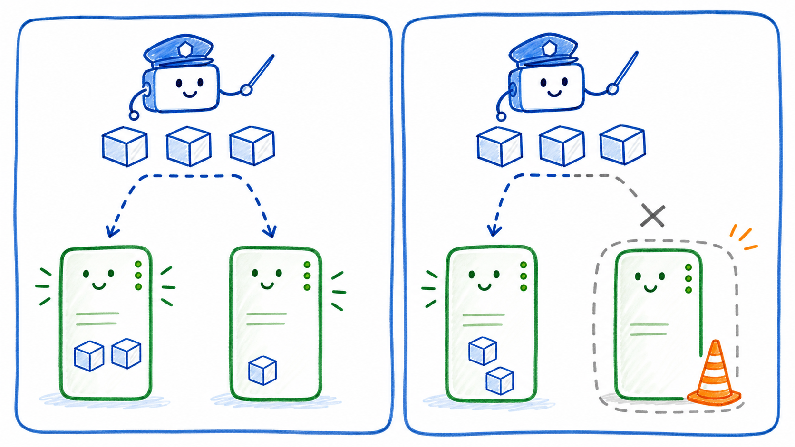

# Stage 2：Node 基本維運

## 這一關的情境

直播平台還在跑，但一台 worker node 要準備維護。你不能直接把它拔掉，因為上面可能還有服務在跑。

前輩說：

> 專業一點。先告訴 Kubernetes：這台機器先不要接新的 Pod。已經在上面跑的東西先不要亂動。

這一關你要學會 `cordon` 和 `uncordon`。

## 你先知道這個就好

Scheduler 是排班員。新的 Pod 要去哪台 Node，通常由 Scheduler 決定。

`cordon` 的意思是把 Node 圍起來，暫時不要讓新的 Pod 排到這台 Node。

`uncordon` 的意思是解除圍線，讓這台 Node 可以重新接受新的 Pod。

`SchedulingDisabled` 不代表 Node 壞掉。它代表這台 Node 目前不接新的 Pod。

已經在 Node 上跑的 Pod，不會因為 `cordon` 自動搬走。

## 看圖理解



你可以把 `cordon` 想成餐廳門口掛上「暫停收新客」。餐廳不一定壞掉，裡面的客人也不會立刻被趕走，只是先不要再安排新客人進去。

```text
cordon 前

Scheduler
  |
  +--> node01 可以接新的 Pod

cordon 後

Scheduler
  |
  +--> node01 還是 Ready
       但暫時不接新的 Pod
```

## 跟著做

先看目前 Node 狀態：

```bash
kubectl get nodes
```

選一台 worker node，讓它暫停接受新的 Pod：

```bash
kubectl cordon <node-name>
```

再查一次 Node 狀態：

```bash
kubectl get nodes
```

你可能會看到類似結果：

```text
NAME           STATUS                     ROLES
controlplane   Ready                      control-plane
node01         Ready,SchedulingDisabled   <none>
```

維護結束後，讓它重新接受新的 Pod：

```bash
kubectl uncordon <node-name>
kubectl get nodes
```

## 看懂結果

重點看 `STATUS` 欄位：

| 狀態 | 白話意思 |
| --- | --- |
| `Ready` | Node 目前可以工作 |
| `Ready,SchedulingDisabled` | Node 還活著，但 Scheduler 不會再排新的 Pod 過去 |

這一關最重要的觀念是：

> `cordon` 改的是「能不能接新工作」，不是宣告這台機器壞掉。

## 常見誤會

- `SchedulingDisabled` 不是故障訊號。
- `cordon` 不會自動移走已經在上面跑的 Pod。
- 如果你不確定哪台是 worker node，回 Stage 1 看 `ROLES`。

## 小任務：確認你真的懂

`Ready,SchedulingDisabled` 比較接近哪個意思？

A. Node 壞掉了  
B. Node 還 Ready，但暫時不接新的 Pod  
C. Pod 全部被刪掉了

建議答案是 B。
