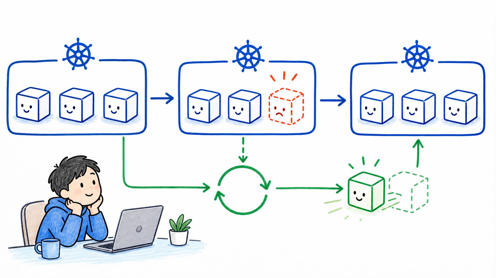

# Stage 4：Deployment 修復與擴充

## 這一關的情境

你查完 Pod 後，前輩出了一題現場小測驗：

> 如果我手動刪掉一個 Pod，服務是不是就少一份了？

你還沒回答，前輩就刪了一個測試 Pod。幾秒後，新 Pod 又長回來。

前輩說：

> 這就是 Kubernetes 最重要的直覺：我們不是只建立一次 Pod，而是宣告希望系統保持什麼狀態。

這一關你要學 Deployment。

## 你先知道這個就好

Deployment 可以先想成「班表」。你不只是在說「現在開一個人上班」，而是在說「這個崗位永遠要有 3 個人值班」。

`replicas` 是你想要的副本數。例如 `replicas=3`，就是希望同一個服務有 3 份 Pod 在跑。

desired state 是你想要的狀態。

current state 是 Kubernetes 目前看到的狀態。

Controller 會一直比對兩者。如果你想要 3 個 Pod，但目前只剩 2 個，它就會補 1 個。

## 看圖理解



先用值班人力想像：

```text
班表規定：櫃台要 3 個人
現場狀態：現在只剩 2 個人
系統動作：補 1 個人回來
```

Deployment 也是同樣概念：

```text
Deployment 宣告：replicas = 3
Kubernetes 看到：目前只有 2 個 Pod
Controller 動作：建立新的 Pod 補回 3 個
```

看這張圖時，先看左邊 desired state，再看右邊 current state，最後看中間 controller loop：


## 跟著做

建立一個測試 Deployment，宣告要 3 份 nginx：

```bash
kubectl create deployment web --image=nginx --replicas=3
```

查看 Deployment：

```bash
kubectl get deployments
```

你可能會看到類似結果：

```text
NAME   READY   UP-TO-DATE   AVAILABLE
web    3/3     3            3
```

查看它背後建立出的 ReplicaSet：

```bash
kubectl get replicasets
```

查看 Pod 實際跑在哪些 Node：

```bash
kubectl get pods -o wide
```

手動刪掉其中一個 Pod：

```bash
kubectl delete pod <pod-name>
```

等幾秒，再查一次：

```bash
kubectl get pods -o wide
kubectl get deployments
```

把副本數從 3 調成 5：

```bash
kubectl scale deployment web --replicas=5
kubectl get pods -o wide
```

## 看懂結果

你手動刪掉一個 Pod 後，會看到兩件事：

- 舊 Pod 消失。
- 新 Pod 被建立，讓數量回到 Deployment 宣告的 `replicas`。

這不是魔法，也不是 Pod 自己復活。真正記住「我要幾份」的是 Deployment，負責補回來的是 controller loop。

| 你做了什麼 | Kubernetes 怎麼理解 |
| --- | --- |
| 建立 Deployment 並設定 `replicas=3` | 你宣告希望有 3 份 Pod |
| 刪掉一個 Pod | current state 變成只剩 2 份 |
| 等幾秒再查 | Controller 發現少了，補一份 |
| scale 到 5 | desired state 改成 5 份 |

## 常見誤會

- Deployment 不是只幫你建立 Pod 一次，它會持續維持副本數。
- 刪掉 Pod 後補回來，不代表剛剛那個 Pod 復活，而是建立了一個新的 Pod。
- Kubernetes 是控制迴圈，不是你按下指令後每件事都立刻同步完成。等幾秒再查很正常。

## 小任務：確認你真的懂

你建立了：

```bash
kubectl create deployment web --image=nginx --replicas=3
```

接著手動刪掉 1 個 Pod。幾秒後 Kubernetes 又補回 1 個新的 Pod。

真正記住「我要 3 份」的是誰？

A. 被刪掉的 Pod  
B. Deployment  
C. `kubectl get pods`

建議答案是 B。
