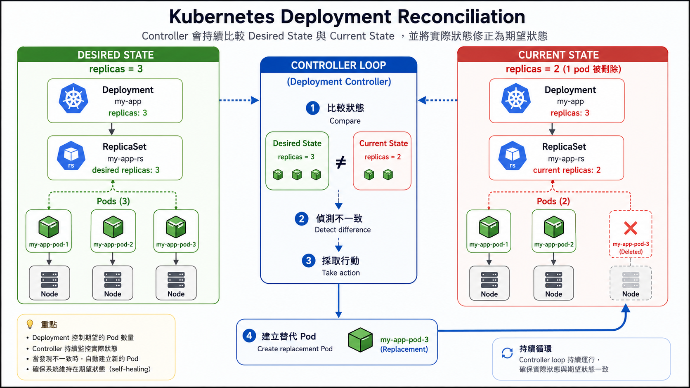

# Stage 4：Deployment 修復與擴充

## 任務簡報

直播平台不能靠手動建立 Pod 撐場。

如果服務需要三份副本，就應該宣告「我要三份」，讓 Kubernetes 持續維持這個狀態。這就是 Deployment 最重要的價值：不是建立一次，而是持續校正。

## 你現在要懂的事

- Deployment 用來管理一組 Pod 副本
- `replicas` 是你宣告的期望副本數
- Pod 被刪掉後，Deployment 會透過 ReplicaSet 補回
- 這個過程就是 desired state 與 current state 的比對
- 你刪的是 Pod，但真正維持數量的是更上層的控制器

## 開始操作

建立一個測試 Deployment：

```bash
kubectl create deployment web --image=nginx --replicas=3
```

確認 Deployment 和 Pod 狀態：

```bash
kubectl get deployments
kubectl get replicasets
kubectl get pods -o wide
```

手動刪掉其中一個 Pod：

```bash
kubectl delete pod <pod-name>
```

再觀察 Pod 是否補回：

```bash
kubectl get pods -o wide
kubectl get deployments
```

調整副本數：

```bash
kubectl scale deployment web --replicas=5
kubectl get pods -o wide
```

## 觀察重點

刪掉 Pod 後，請觀察兩件事：

- 原本的 Pod 會消失
- 新的 Pod 會被建立，讓副本數回到 Deployment 宣告的數量

這不是魔法，是 Controller 在持續修正狀態。

## 卡關提示

如果 Pod 沒有立刻補回，先等幾秒再查一次。

Kubernetes 是控制迴圈，不是同步函式呼叫。它會持續觀察、比對、修正。

## Deployment 校正流程



## 思考一下

你刪掉的是 Pod，為什麼 Kubernetes 又補了一個新的 Pod？真正記住「我要幾份副本」的是誰？
