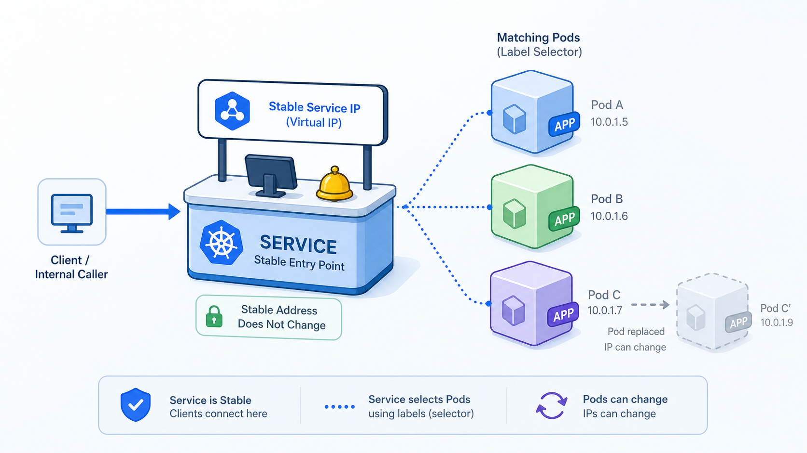

# Stage 6：Service 服務入口

## 這一關的情境

前一關你把直播服務放進 `npc-live`。現在 Deployment 已經有 Pod 在跑，前輩卻問你：

> 如果 Pod 被補了一個新的，它的 IP 可能會變。那直播平台其他服務要連誰？

這一關你要學 Service。它的任務不是取代 Pod，而是替一組 Pod 提供穩定入口。

## 你先知道這個就好

Pod 像臨時演員。它可以被刪掉、重建、換名字、換 IP。

Service 像櫃台分機。前台不用記每個臨時演員的手機號碼，只要打固定分機，Service 會幫忙導到目前活著的 Pod。

Label 是 Pod 身上的名牌。

Selector 是 Service 找 Pod 的條件。Service 不是靠 Pod 名字找人，而是看 label 是否對得上。

`ClusterIP` 是 cluster 內部使用的穩定入口。這一關先學內部入口，不碰 Ingress 或外部流量。

## 看圖理解

先看這張圖：左邊的呼叫者不用記住每個 Pod 的 IP，只要連到中間穩定的 Service。Service 再用 selector 找到右邊符合 label 的 Pod。



```text
其他 Pod
  |
  v
Service: live-web-svc
  |
  +-- selector: app=live-web
        |
        +--> Pod A: app=live-web
        +--> Pod B: app=live-web
```

你現在要看懂的是：

> Service 本身不是服務程式。它是穩定入口，背後會指到符合 label 的 Pod。

## 跟著做

先確認 Deployment 和 Pod 的 label：

```bash
kubectl get deployment live-web -n npc-live --show-labels
kubectl get pods -n npc-live --show-labels
```

你可能會看到類似結果：

```text
NAME                       READY   STATUS    LABELS
live-web-6c8b7c5f9d-x1y2z  1/1     Running   app=live-web
live-web-6c8b7c5f9d-p9q8r  1/1     Running   app=live-web
```

建立 Service，替 `live-web` 這個 Deployment 建立穩定入口：

```bash
kubectl expose deployment live-web --name=live-web-svc --port=80 --target-port=80 -n npc-live
```

查看 Service：

```bash
kubectl get svc -n npc-live
```

你可能會看到類似結果：

```text
NAME           TYPE        CLUSTER-IP      PORT(S)
live-web-svc   ClusterIP   10.96.120.55    80/TCP
```

查看 Service 目前實際導到哪些 Pod IP：

```bash
kubectl get endpoints -n npc-live
```

你可能會看到類似結果：

```text
NAME           ENDPOINTS
live-web-svc   10.244.1.12:80,10.244.1.13:80
```

從 cluster 內部測試 Service：

```bash
kubectl run curl-test --image=curlimages/curl -n npc-live --rm -it --restart=Never -- curl live-web-svc
```

## 看懂結果

Service 排查時先看兩層：

| 你查什麼 | 代表什麼 |
| --- | --- |
| `kubectl get svc -n npc-live` | Service 這個穩定入口有沒有存在 |
| `kubectl get endpoints -n npc-live` | Service 背後有沒有真的找到 Pod |

如果 Service 存在，但 endpoints 是空的，通常代表 selector 沒有選到任何 Pod。

你可以把它想成：櫃台招牌掛好了，但後面沒有任何值班人員接電話。

```text
Service 有門牌
  |
  v
Endpoints 有後端 Pod
  |
  v
流量才有地方去
```

## 常見誤會

- Service 不是 Pod，它不會自己跑你的 nginx。
- Service 找 Pod 靠 label，不是靠 Pod 名稱。
- Pod IP 可能會變，所以不要把 Pod IP 當長期入口。
- 這一關的 `ClusterIP` 只處理 cluster 內部連線，不是公開網站入口。

## 小任務：確認你真的懂

你看到：

```text
kubectl get svc -n npc-live       有 live-web-svc
kubectl get endpoints -n npc-live endpoints 是空的
```

最可能先檢查哪裡？

A. Service 的 selector 和 Pod label 有沒有對上  
B. Node 的 Kubernetes 版本  
C. Secret 有沒有 base64

建議答案是 A。Service 有入口但找不到後端時，先看 selector 和 label。
