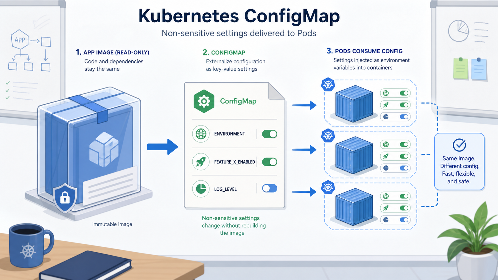

# Stage 7：ConfigMap 設定管理

## 這一關的情境

直播服務穩定跑起來後，產品同事跑來說：

> 今天是訓練環境，功能開關先打開。明天如果換成正式環境，不要每次都重做 image。

前輩轉頭看你：

> 程式和設定要分開。非敏感設定先放 ConfigMap。

這一關你要學 ConfigMap。它用來保存不敏感的設定，例如環境名稱、功能開關、一般 API URL。

## 你先知道這個就好

Container image 像便當盒。程式已經包在裡面，不應該每次換醬料就重做一個便當盒。

ConfigMap 像貼在便當外面的設定單。今天是訓練環境、功能開關要不要開、一般 URL 是什麼，這些可以由外部設定交給 Pod。

ConfigMap 放的是非敏感設定。密碼、token、憑證不要放這裡。

Pod 讀到 ConfigMap 的方式很多，這一關先用環境變數理解。

## 看圖理解

先看這張圖：左邊的 app image 保持不變，中間的 ConfigMap 提供外部設定，右邊的 Pod 讀到這些設定。重點是「程式碼和設定分開」。



```text
ConfigMap: live-web-config
  |
  +-- APP_ENV=training
  +-- FEATURE_BASKETBALL=true
        |
        v
Deployment live-web
        |
        v
Pod 裡變成環境變數
```

你現在要記住：

> ConfigMap 管設定，不管程式碼，也不適合放秘密。

## 跟著做

建立直播平台的非敏感設定：

```bash
kubectl create configmap live-web-config \
  --from-literal=APP_ENV=training \
  --from-literal=FEATURE_BASKETBALL=true \
  -n npc-live
```

查看 ConfigMap 是否建立：

```bash
kubectl get configmap -n npc-live
```

你可能會看到類似結果：

```text
NAME              DATA   AGE
live-web-config   2      20s
```

看 ConfigMap 裡有哪些 key：

```bash
kubectl describe configmap live-web-config -n npc-live
```

你可能會看到類似結果：

```text
Name:         live-web-config
Namespace:    npc-live
Data
====
APP_ENV:
----
training
FEATURE_BASKETBALL:
----
true
```

把 ConfigMap 注入 Deployment，讓 Pod 以環境變數讀到設定：

```bash
kubectl set env deployment/live-web --from=configmap/live-web-config -n npc-live
```

等待 Deployment 更新完成：

```bash
kubectl rollout status deployment/live-web -n npc-live
```

進 Pod 裡確認環境變數：

```bash
kubectl exec -n npc-live deployment/live-web -- printenv | grep APP_ENV
```

你可能會看到：

```text
APP_ENV=training
```

## 看懂結果

重點是分清楚「設定在哪裡」和「Pod 有沒有讀到」：

| 你查什麼 | 代表什麼 |
| --- | --- |
| `kubectl get configmap -n npc-live` | ConfigMap 物件有沒有存在 |
| `kubectl describe configmap ...` | ConfigMap 裡有哪些設定 key |
| `kubectl set env ...` | 把設定交給 Deployment |
| `kubectl exec ... printenv` | Pod 裡是否真的讀到環境變數 |

如果 ConfigMap 更新後，舊 Pod 不一定會自動拿到新值。用環境變數注入時，常見做法是讓 Pod 重新 rollout。

```bash
kubectl rollout restart deployment/live-web -n npc-live
```

## 常見誤會

- ConfigMap 不是 Secret，不要放密碼。
- ConfigMap 存在，不代表 Pod 已經讀到它。
- 更新 ConfigMap 後，既有 Pod 不一定會自動更新環境變數。
- ConfigMap 適合放環境名稱、功能開關、一般設定，不適合放 token。

## 小任務：確認你真的懂

下面哪一個適合放進 ConfigMap？

A. `APP_ENV=training`  
B. `DATABASE_PASSWORD=super-secret`  
C. 第三方付款 API token

建議答案是 A。ConfigMap 放非敏感設定；密碼和 token 應該交給 Secret。
