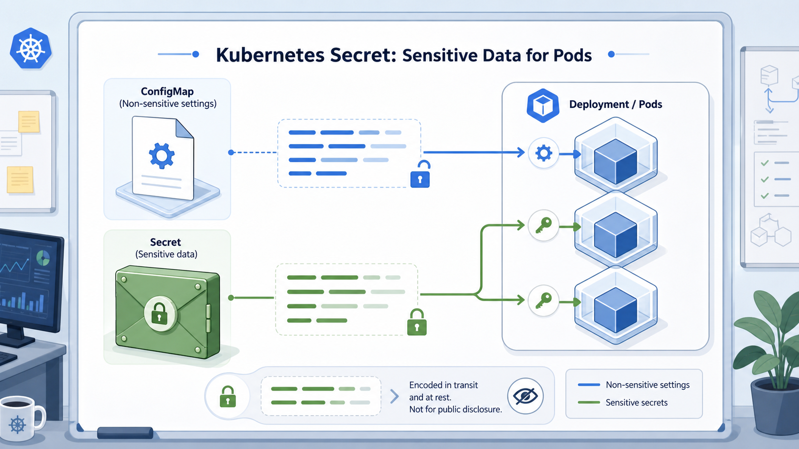

# Stage 8：Secret 敏感資訊

## 這一關的情境

你剛學會用 ConfigMap 放非敏感設定，前輩立刻補一句：

> 很好。那 API token、資料庫密碼、第三方服務金鑰呢？

你正想說「也放 ConfigMap」，前輩已經搖頭。

這一關你要學 Secret。它是 Kubernetes 裡專門用來存放敏感資訊的資源類型。

## 你先知道這個就好

Secret 可以先想成戰情室裡的密封信封。大家知道有這封信，但不應該把內容直接貼在白板上。

Secret 適合放 API token、密碼、憑證這類敏感資訊。

Secret 預設會以 base64 形式呈現，但 base64 只是編碼，不是強加密。看到亂碼樣子，不代表可以公開。

真實環境還需要搭配 RBAC、加密 at rest、外部 secret manager 等保護。這一關先學基本用法和正確直覺。

## 看圖理解

先看這張圖：ConfigMap 和 Secret 都可以把資料交給 Pod，但 Secret 用來放敏感資訊。圖裡的鎖和鑰匙是在提醒你：Secret 比 ConfigMap 更適合放 token、密碼和憑證，但不代表可以隨便公開。



```text
Secret: live-web-secret
  |
  +-- API_TOKEN=training-token
        |
        v
Deployment live-web
        |
        v
Pod 裡用環境變數讀到 token
```

把 ConfigMap 和 Secret 分開想：

| 資源 | 放什麼 |
| --- | --- |
| ConfigMap | 非敏感設定，例如環境名稱、功能開關 |
| Secret | 敏感資訊，例如 token、密碼、憑證 |

## 跟著做

建立一個訓練用 Secret：

```bash
kubectl create secret generic live-web-secret \
  --from-literal=API_TOKEN=training-token \
  -n npc-live
```

查看 Secret 是否存在：

```bash
kubectl get secret -n npc-live
```

你可能會看到類似結果：

```text
NAME              TYPE     DATA   AGE
live-web-secret   Opaque   1      15s
```

看 Secret 的 key 和大小，不直接顯示明文：

```bash
kubectl describe secret live-web-secret -n npc-live
```

你可能會看到類似結果：

```text
Name:         live-web-secret
Namespace:    npc-live
Type:         Opaque

Data
====
API_TOKEN:    14 bytes
```

把 Secret 注入 Deployment：

```bash
kubectl set env deployment/live-web --from=secret/live-web-secret -n npc-live
```

等待 Deployment 更新完成：

```bash
kubectl rollout status deployment/live-web -n npc-live
```

在訓練環境裡確認 Pod 能讀到這個環境變數：

```bash
kubectl exec -n npc-live deployment/live-web -- printenv | grep API_TOKEN
```

你可能會看到：

```text
API_TOKEN=training-token
```

查看 Secret YAML 時，你會看到 base64 形式的值：

```bash
kubectl get secret live-web-secret -n npc-live -o yaml
```

## 看懂結果

`kubectl describe secret` 不會直接印出明文，只會告訴你有哪些 key 和資料大小。

如果用 YAML 看 Secret，可能會看到像這樣：

```yaml
data:
  API_TOKEN: dHJhaW5pbmctdG9rZW4=
```

這看起來不像原本的 token，但它只是 base64 編碼。它不是「可以放心公開」的保護。

```text
Secret 比 ConfigMap 更適合放敏感資訊
但 Secret 不等於萬無一失
```

## 常見誤會

- Secret 的 base64 不是加密，不要把它當成保險箱。
- 不要把密碼直接寫進 Deployment YAML、image 或指令歷史。
- Secret 和 ConfigMap 用法很像，但用途不同。
- 真實正式環境還要考慮權限、加密和外部密鑰管理。

## 小任務：確認你真的懂

你看到 Secret YAML 裡的值長這樣：

```text
dHJhaW5pbmctdG9rZW4=
```

這代表什麼？

A. 它是 base64 編碼，不等於可以公開  
B. 它已經強加密，可以貼到公開文件  
C. 它是壞掉的 token

建議答案是 A。base64 只是編碼，不是強加密。
